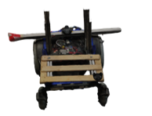
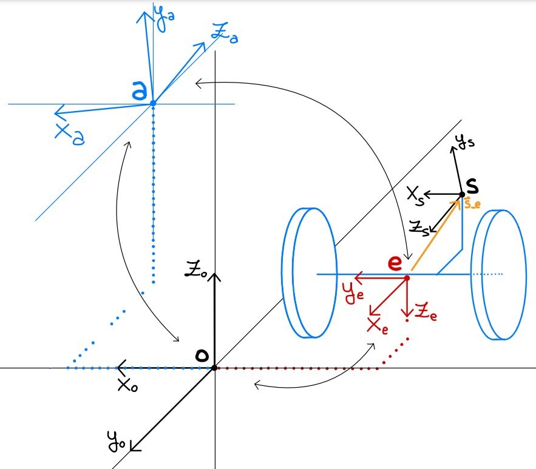
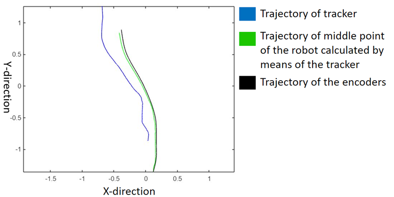
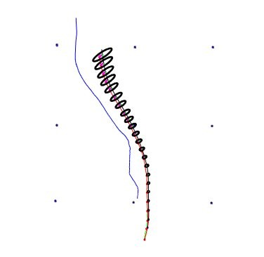

# Mobile Robot Sensor Fusion
This project has been developed for the course of "Robotics Perception and Action" held at the University of Trento, Italy. It consists of a sensor fusion algorithm to estimate the actual position of the robot, given encoders and an HTC tracker implemented in Matlab.

## Authors
- [Calai Simone](https://github.com/simonecalai)
- [Meroli Alessandro](https://github.com/Meroli00)
- [Sevenhuijsen Merlijn](https://github.com/SevenhuijsenM)
- [Zafalon Giacomo](https://github.com/GiacomoZafalon)

## Setup
- Automated wheelchair controlled manually
- 2 encoders placed on the wheelchair's rear wheels
- HTC Vive Tracker 1.0 placed on the robot
- HTC Base Stations 1.0 located in the room

<figure style="text-align: center">

<figcaption>   </figcaption>
</figure>

### Encoders
To get the position and orientation of the robot through the encoders we used the following formulas:
- $x_{k+1} = x_k + \pi\frac{ticks_{right}radius_{right} + ticks_{left}radius_{left}}{ticks_{revolution}}cos(angle_k)$
- $y_{k+1} = y_k + \pi\frac{ticks_{right}radius_{right} + ticks_{left}radius_{left}}{ticks_{revolution}}sin(angle_k)$
- $\theta_{k+1} = \theta_k + 2\pi\frac{ticks_{right}radius_{right} - ticks_{left}radius_{left}}{ticks_{revolution}base}$

### HTC Vive Tracker 1.0
The output of the HTC Vive Tracker 1.0 is given by a 7-element array containing coordinates with respect to the base station: 
[coord_x, coord_y, coord_z, quat_x, quat_y, quat_z, quat_w].

With the tracker we had to work with numerous reference frames to be able to express the coordinates in the same reference frame as the one used by the encoders, so the middle point of the wheel axis. In the image below the different frames can be seen, where "e" is the middle point of the wheel axis, "s" is the tracker, "a" is the main base station, and "o" is a point in space selected to be the final absolute reference frame  
<figure style="text-align: center">

<figcaption>   </figcaption>
</figure>

## Trajectory computation
By placing the sensor on the wheels we were able to compute the coordinates of the middle point "e", after this operation we could place the tracker "s" wherever on the robot and perform any trajectory and still be able to track the position of "e", by roto-translating the vector connecting "e" and "s" (s_e) based on the data acquired from the tracker.
<figure style="text-align: center">

<figcaption>   </figcaption>
</figure>

## Final result
We computed the uncertainty of both sensors following the instructions described in the paper by Professor De Cecco et al. [1] which we then combined to obtain a fused signal [2]. What we expected was to get a trajectory very close to the tracker's one, since it had much lower uncertainty than the encoders'. In the picture below we can see the uncertainty ellipsoids computed for the encoders and the tracker. The encoders' one tends to grow the longer the simulation is run, this is due to the incremental nature of these sensors, while the uncertainty of the tracker is computed in different points of the room (and later interpolated) and shows higher values in the areas where the cameras where obstructed.

<figure style="text-align: center">

<figcaption>   </figcaption>
</figure>

## References
[1] De Cecco, Mariolino, Luca Baglivo, and Francesco Angrilli. "Real-time uncertainty estimation of autonomous guided vehicle trajectory taking into account correlated and uncorrelated effects." IEEE Transactions on Instrumentation and Measurement 56.3 (2007): 696-703, doi: [10.1109/TIM.2007.894904](https://ieeexplore.ieee.org/abstract/document/4200988). 
[2] De Cecco, Mariolino. "Sensor fusion of inertial-odometric navigation as a function of the actual manoeuvres of autonomous guided vehicles." Measurement Science and Technology 14.5 (2003): 643, doi: [10.1088/0957-0233/14/5/316](https://iopscience.iop.org/article/10.1088/0957-0233/14/5/316/meta).
